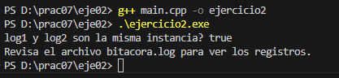
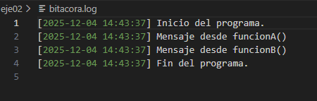

# Ejercicio 02 (Intermedio): Singleton con recursos compartidos

Implemente una clase `Logger` que registre mensajes de log en un archivo de texto (por ejemplo `bitacora.log`).

## Requisitos

- Solo debe existir **una instancia** de `Logger`.  
- Implementa un método `log(mensaje)` que agregue el texto al archivo junto con la hora actual.  
- Prueba el logger desde distintos puntos del programa y confirma que todos usan **el mismo archivo**.

---

## Solución

En este ejercicio se implementa el **patrón Singleton** para la clase `Logger`.  
Esto garantiza que **solo exista una instancia** del logger durante todo el programa, de manera que todos los mensajes se escriban en el **mismo archivo** `bitacora.log`.  

Se prueba el Singleton creando dos referencias `log1` y `log2`, registrando mensajes desde distintas funciones (`funcionA`, `funcionB`) y desde distintos puntos del `main`. Todos los registros se almacenan en el mismo archivo.

### Ejemplo de salida del programa

### Contenido del archivo `bitacora.log`

**Explicación de la salida y la bitácora:**

1. La línea `log1 y log2 son la misma instancia? true` confirma que **solo existe un logger**, cumpliendo el patrón Singleton.  
2. Los mensajes `"Inicio del programa."`, `"Mensaje desde funcionA()"`, `"Mensaje desde funcionB()"` y `"Fin del programa."` se registran en el mismo archivo `bitacora.log`.  
3. Cada registro incluye la **fecha y hora actual**, mostrando el orden y momento en que se ejecutaron las acciones.  
4. Esto demuestra que **todas las funciones y referencias usan la misma instancia del Logger**, cumpliendo con los requisitos del ejercicio.
