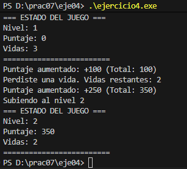

# Ejercicio 04 (Avanzado): Singleton en un juego

Desarrolla una clase `ControlJuego` para manejar el estado global de un juego (**nivel actual, puntaje, vidas**).

## Requisitos

- Usar **Singleton** para asegurar que solo exista **una única instancia**.  
- Gestionar el estado global del juego:  
  - Nivel actual  
  - Puntaje  
  - Vidas  
- Simular en el `main` cómo distintos módulos acceden y modifican el mismo `ControlJuego`.

---

## Solución

En este ejercicio se implementa la clase `ControlJuego` mediante el **patrón Singleton**, garantizando que todos los componentes del juego (jugador, enemigos, interfaz) trabajen sobre **una sola instancia compartida** del estado del juego.

Esto permite que cualquier módulo pueda consultar o modificar información como el puntaje, el nivel o las vidas sin riesgo de duplicar el estado o generar inconsistencias.

La clase mantiene:

- `nivel`  
- `puntaje`  
- `vidas`  

Y provee métodos como:

- `subirNivel()`  
- `agregarPuntaje(int puntos)`  
- `perderVida()`  
- `mostrarEstado()`  

En el `main`, distintos módulos simulan acciones del juego mediante llamadas a la **misma instancia del Singleton**, demostrando que todos operan sobre el mismo estado.

---

## Explicación de la salida del código

1. Se obtienen dos referencias (`c1` y `c2`) usando `getInstancia()`.  
   Al verificarse `(&c1 == &c2)` se muestra `true`, confirmando que ambas apuntan a la **misma instancia Singleton**.

2. Se muestra el estado inicial del juego:  
   - Nivel 1  
   - Puntaje 0  
   - Vidas 3  

3. El módulo del **jugador**:  
   - Gana 100 puntos  
   - Pierde una vida  

4. El módulo de **enemigos**:  
   - Agrega 250 puntos por eliminar un enemigo  

5. Otra parte del juego **sube el nivel global**.  

6. La **interfaz** muestra el estado final actualizado, demostrando que todas las modificaciones se realizaron sobre una **sola instancia compartida** del juego.

---

## Salida de Código

