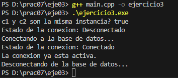

# Ejercicio 03 (Aplicado): Conexión simulada a base de datos

Crea una clase `ConexionBD` que simule la conexión a una base de datos.

## Requisitos

- Solo debe haber **una conexión activa** (Singleton).  
- Incluye métodos como `conectar()`, `desconectar()` y `estado()`.  
- Si alguien intenta crear otra conexión, debe devolverse **la misma instancia** ya existente.

---

## Solución

En este ejercicio se implementa el **patrón Singleton** para la clase `ConexionBD`.  
Esto garantiza que **solo exista una conexión activa** a la vez. La clase incluye métodos para:

- `conectar()` → simula abrir la conexión.  
- `desconectar()` → simula cerrar la conexión.  
- `estado()` → muestra si la conexión está activa o no.  

Se prueban múltiples referencias (`c1` y `c2`) y funciones (`funcionX`, `funcionY`) para demostrar que **todas usan la misma instancia**.

### Ejemplo de salida del programa

**Explicación de la salida:**

1. La línea `c1 y c2 son la misma instancia? true` confirma que **solo hay una instancia de ConexionBD**, cumpliendo el patrón Singleton.  
2. Al llamar `c1.estado()`, inicialmente la conexión está **Desconectada**.  
3. Luego, `c1.conectar()` activa la conexión, y cualquier otra referencia (`c2` o desde funciones) refleja el mismo estado porque apuntan a la **misma instancia**.  
4. Intentar conectar de nuevo muestra `"La conexion ya esta activa."`, confirmando que no se crea una nueva instancia.  
5. Finalmente, `c2.desconectar()` cambia el estado a desconectado, mostrando que **todas las referencias comparten el mismo objeto**.
