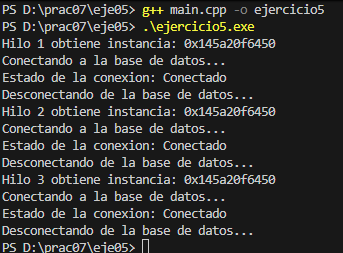

# Ejercicio 05 (Desafío): Singleton con subprocesos (thread-safe)

Se modifica el ejercicio 3 (`ConexionBD`) para que sea seguro en **entornos multihilo**.

## Requisitos

- Mantener el **patrón Singleton** para la conexión a la base de datos.  
- Hacer la instancia **thread-safe** usando:
  - **bloqueo (mutex)** o  
  - **verificación doble (double-checked locking)**.  
- Evitar que múltiples hilos creen **más de una instancia** simultáneamente.

---

## Solución

Se agrega un **mutex estático** para proteger la creación de la instancia.  
Esto asegura que aunque varios hilos llamen a `getInstancia()` al mismo tiempo, **solo se crea una instancia** de `ConexionBD`.  

La técnica de **double-checked locking** permite que la sincronización solo ocurra la **primera vez**, reduciendo la sobrecarga de los accesos posteriores.

Para evitar que la salida en consola se mezcle entre hilos, se usa un **mutex adicional** al imprimir (`std::cout`), garantizando que cada hilo muestre su información de manera ordenada.

---

## Explicación de la salida del código

1. Cada hilo obtiene la instancia de `ConexionBD` mediante `getInstancia()`.  
2. La línea `Hilo X obtiene instancia: 0x...` confirma que **todos los hilos usan la misma dirección de memoria**, es decir, **la misma instancia Singleton**.  
3. Cada hilo llama a `conectar()`, `estado()` y `desconectar()`, y la salida muestra que **el estado de la conexión es compartido** entre hilos.  
4. Gracias al **mutex para la impresión**, las líneas se muestran de forma limpia, evitando que se mezclen mensajes de distintos hilos.  
5. Esto confirma que el **Singleton es thread-safe**: **no se crean múltiples instancias** y todos los hilos operan sobre el **mismo objeto compartido**.

---

